# Image processing assignment 1
There are two parts to this assignment:
* Image processing (blurring, edge detection, convolutions etc.)
* Handwritten digit classification with neural networks on the MNIST dataset 

## Getting started
```
conda install tqdm
conda install -c conda-forge scikit-image
```
PyTorch with CUDA:
```
conda install pytorch torchvision cudatoolkit=10.2 -c pytorch
```
If we want to use the CPU only (not CUDA) we can run this command instead of the above: `$ conda install pytorch torchvision cpuonly -c pytorch`

## Image processing results
### Original image


### Greyscaled image
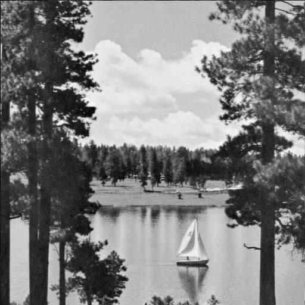

### Inversed greyscale image
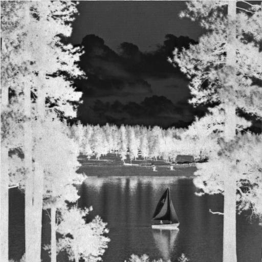

### Vertical Sobel kernel for vertical edge detection


### Blurred original image
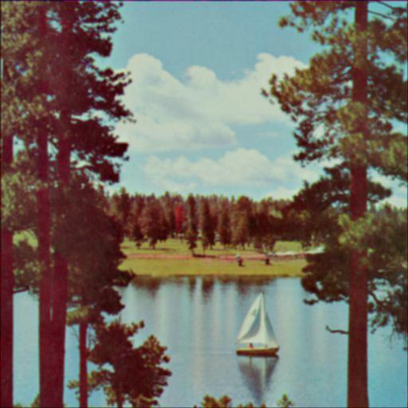

## Neural network results
### Normalized vs. original data
As we can see, the neural network performs better when the data is normalized (i.e when the image is normalized between the range [-1, 1]).
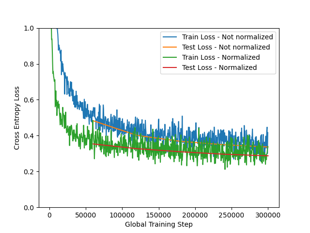

### Weights for each class
The images below represent the inputs that are important for a certain class (i.e. the weights). As an example, let us inspect 0. The 0 class cares most about whether the pixels around the center is lit up and not the center itself.

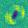
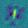


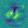
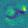

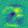
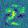


### Learning rate of 1.0
Normally, the learning rate is 0.192, but here we set it to 1.0. What happens is that the model performs worse than with a learning rate of 0.192. This is because the learning rate is too high, so the gradient descent algorithm fails to converge.

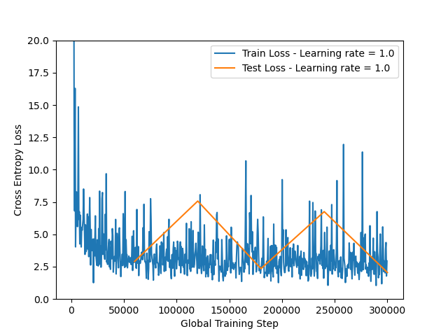

### One hidden layer
With one hidden layer, we can see that the model learns better. The loss does not stop at 0.3 but keeps sinking down to 0.2 as the step increases
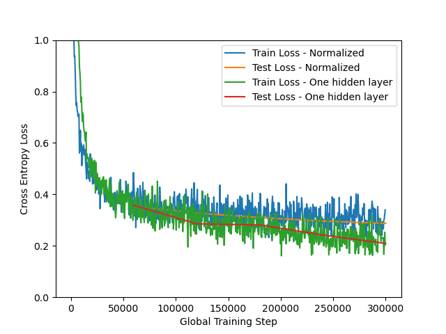


