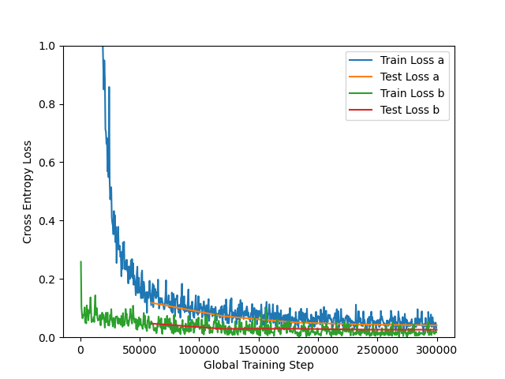
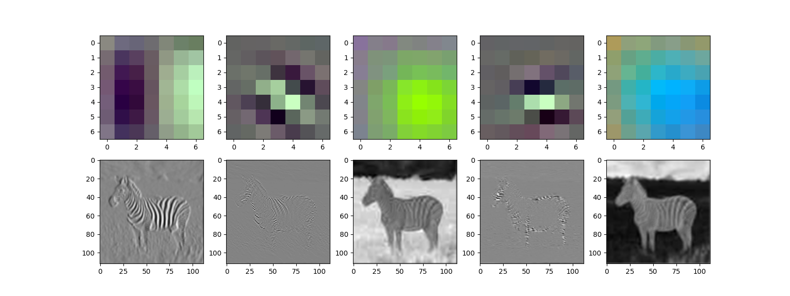
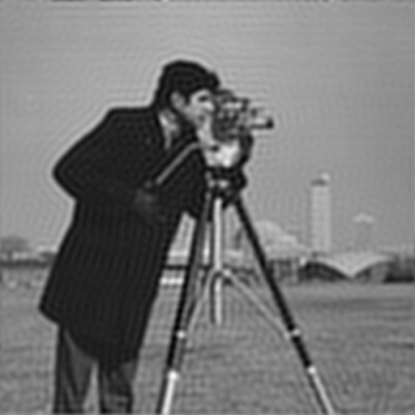
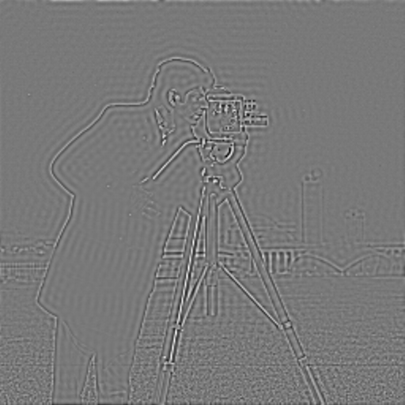
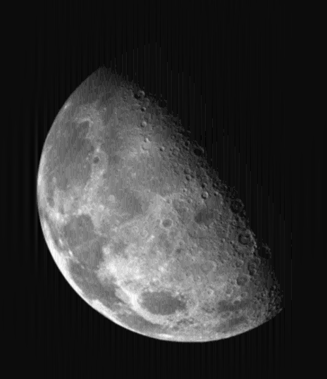
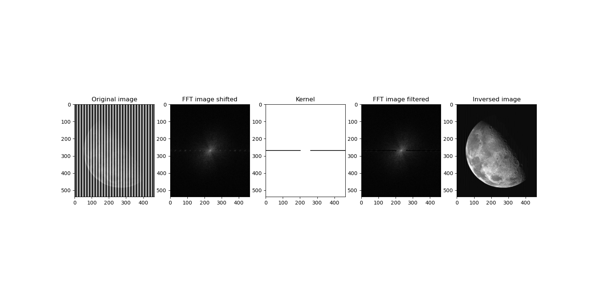

# Assignemnt 2 TDT4195

## Task 1
For a sqaure image, with a square filter we have:

$outputImageDimension = (inputImageDimension - filterDimension + 2 * padding) / stride + 1$

### 1.a)
For the output image to be the same dimension of the input image, we need the padding to be so large that the filter is applied to every border/corner pixel. So, for a kernel size of $5x5$, it will go 2 pixels "out" of the border/corner pixels. Thus, the padding must be **2 pixels**.

### 1.b)

$(outputImageDimension - 1) * stride - 2 * padding - inputImageDimension = -filterDimension$  
$filterDimension = -((outputImageDimension - 1) * stride - 2 * padding - inputImageDimension)$  
$filterDimension = -(outputImageDimension - 1) * stride + 2 * padding + inputImageDimension)$  
$filterDimension = -(504 - 1) * 1 + 2 * 0 + 512)$  
$filterDimension = - 503 + 512 = 9$

Thus, the padding is $9x9$.

### 1.c)
If we perform pooling/subsampling with a $2x2$ kernel on a $504x504$ layer with a stride of 2, we will simply half the image's height and width, because each $2x2$ pixel-block will be reduced to a single pixel. Thus, the output, after the pooling layer, is $252x252$.

### 1.d)
$outputImageDimension = (252 - 3 + 2 * 0) / 1 + 1 = 249 + 0 + 1 = 250$

### 1.e)
Each filter has $filterDimension^2 * channels$ number of weights. So, a $5x5$ filter with 3 channels, will have $5^2*3=75$ number of weights. Since we can have more than one filter, we multiply the result with the number of filters. So, 32 filters result in $75*32=2400$ weights.  
The number of biases is the same as the number of filters. So, we have a total of $2400+32=2432$ paremeters.

We use the formula $kernel\ dimension*input\ channels*number\ of\ filters+number\ of\ filters\ (i.e.\ bias)$ to calculate the number of parameters in each convolutional layer.

Convolution layer 1:
* Input 32x32 with 3 channels (RGB)
* Kernel = 5x5, stride = 1, padding = 2
* Filter dimension = 5x5x3
* Number of filters = 32
* Number of parameters = $5^2*3*32+32=2432$
* Output dimension: 32x32 (unchanged)

Pooling layer 1:
* Input 32x32
* Max pooling with kernel size = 2x2, stride = 2
* Output 16x16

Convolution layer 2:
* Input 16x16 with 32 channels
* Kernel = 3x3, stride = 1, padding = 1
* Number of filters = 64
* Filter dimension = 3x3x32
* Number of parameters = $3^2*32*64+64=18496$
* Output dimension: 16x16 (unchanged)

Pooling layer 2:
* Input 16*16
* Max pooling with kernel size = 2x2, stride = 2
* Output 8x8

Convolution layer 3:
* Input 8x8 with 64 channels
* Kernel = 3x3, stride = 1, padding = 1
* Number of filters = 128
* Filter dimension = 3x3x64
* Number of parameters = $3^2*64*128+128=73856$
* Output dimension: 8x8 (unchanged)

Pooling layer 3:
* Input 8x8
* Max pooling with kernel size = 2x2, stride = 2
* Output 4x4

Flatten:
* Input 4x4 with 128 channels = 2048 input nodes

Fully-connected layer 1:
* Input nodes: 2048
* Output nodes: 64
* Connections = weights + biases = $2048*64+64=131136$

Fully-connected layer 2:
* Input units = 64
* Output units = 10
* Connections = weights + biases = $64*10+10=650$

For a total of $2432+18496+73856+131136+650=226570$ parameters.

## Task 2

### 2.a)
Final Test loss: 0.041. Final Test accuracy: 0.987

### 2.b)

### 2.c)

Original image:

Weights and activations:

### 2.d)
The five filters explained:
1. This filter is clearly a vertical edge-detection filter, and can be seen as the Sobel operator. We see that the Zebra's vertical stripes are clear, while the horizontal line between the sky and the grass (blue-green) is nearly gone.
2. This filter looks like it detects diagonal black stripes (different from normal edge detection as the filter has negative-positive-negative stripes instead of negative-positive stripes).
3. This filter is used to detect green values, as the grass is lit.
4. This filter looks like it detects horionztal black stripes (as point 2. mentioned).
5. This filter is used to detect blue balues, as the sky is lit.

## Task 3

### 3.a)
The wider dots in the frequency domain is, the higher the frequency (smaller distance) of the lines in the spatial domain.
Horizontal lines in the spatial domain get vertical dots in the frequency domain
* 1a - 2e
* 1b - 2c
* 1c - 2f

Vertical lines in the spatial domain get horizontal dots in the frequency domain
* 1d -  2b
* 1e -  2d
* 1f -  2a

### 3.b)

A low-pass filter removes all high frequencies, while a high-pass filter removes all low frequencies. Low-pass filters are often used to blur/remove noise, becuase high frequencies are often noise. While high-pass filters are often used for edge detection.

### 3.c)
Image (a) is a high-pass filter, while image (b) is a low-pass filter. Low-pass are dark around, while high-pass are dark in the middle.

## Task 4

## 4.a)
Low pass:

High pass:

## 4.b)
Not completed.

## 4.c)
Result:

Kernel and FFT:

## 4.d)

Not completed.

