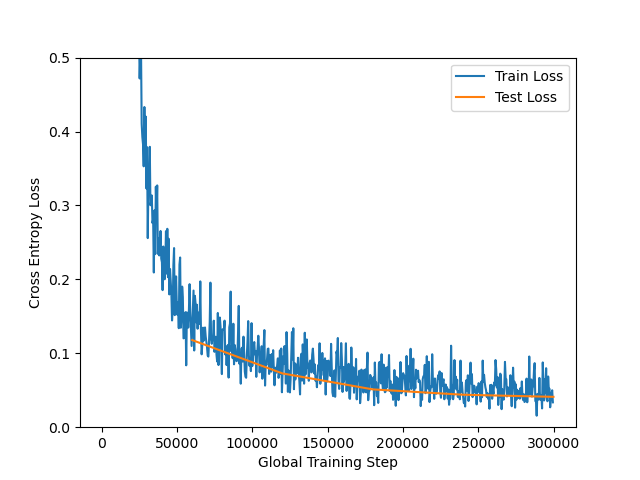

# Assignemnt 2 TDT4195

## Task 1
For a sqaure image, with a square filter we have:

$outputImageDimension = (inputImageDimension - filterDimension + 2 * padding) / stride + 1$

### 1.a)
For the output image to be the same dimension of the input image, we need the padding to be so large that the filter is applied to every border/corner pixel. So, for a kernel size of $5x5$, it will go 2 pixels "out" of the border/corner pixels. Thus, the padding must be **2 pixels**.

### 1.b)

$(outputImageDimension - 1) * stride - 2 * padding - inputImageDimension = -filterDimension$  
$filterDimension = -((outputImageDimension - 1) * stride - 2 * padding - inputImageDimension)$  
$filterDimension = -(outputImageDimension - 1) * stride + 2 * padding + inputImageDimension)$  
$filterDimension = -(504 - 1) * 1 + 2 * 0 + 512)$  
$filterDimension = - 503 + 512 = 9$

Thus, the padding is $9x9$.

### 1.c)
If we perform pooling/subsampling with a $2x2$ kernel on a $504x504$ layer with a stride of 2, we will simply half the image's height and width, because each $2x2$ pixel-block will be reduced to a single pixel. Thus, the output, after the pooling layer, is $252x252$.

### 1.d)
$outputImageDimension = (252 - 3 + 2 * 0) / 1 + 1 = 249 + 0 + 1 = 250$

### 1.e)
Each filter has $filterDimension^2 * channels$ number of weights. So, a $4x4$ filter with 3 channels, will have $4^2 * 3 = 16 * 3 = 48$ number of weights. Since we can have more than one filter, we multiply the result with the number of filters. So, three filters result in $48*3=144$ weights.  
The number of biases is the same as the number of filters. So, we have a total of $144+3=147$ weights.

Convolution layer:
* Input 32x32 with 1 channels (grayscale)
* Kernel = 5x5, stride = 1, padding = 2
* Output 32x32
* Number of filters = 32
* Number of weights = $5^2*1*32+32=832$
* Number of output channels = $1*32=32$

Pooling layer:
* Input 32x32
* Max pooling with kernel size = 2x2, stride = 2
* Output 16*16

Convolution layer:
* Input 16x16 with 32 channels
* Kernel = 3x3, stride = 1, padding = 1
* Output 16*16
* Number of filters = 64
* Number of weights = $3^2*32*64 + 64=18 496$
* Number of output channels = $32*64=2048$

Pooling layer:
* Input 16*16
* Max pooling with kernel size = 2x2, stride = 2
* Output 8x8

Convolution layer:
* Input 8x8 with 2048 channels
* Kernel = 3x3, stride = 1, padding = 1
* Output 8x8
* Number of filters = 128
* Number of weights = $3^2*2048*128 + 128=2 359 424$
* Number of output channels = $2048*128=262 144$

Pooling layer:
* Input 8x8
* Max pooling with kernel size = 2x2, stride = 2
* Output 4x4

Flatten:
* Input 4x4 with 262 144 = 4 194 304 inputs

Fully-connected layer:
* Input units = 4 194 304
* Output units = 64
* Connections =  $4 194 304 * 64 = 268 435 456$

Fully-connected layer:
* Input units = 64
* Output units = 10
* Connections = $64 * 10 = 640$

For a total of $32 + 2048 + 262 144 + 268 435 456 + 640 = 268 700 320$ weights.

## Task 2

### 2.a)
Final Test loss: 0.041. Final Test accuracy: 0.987

## 2.b)

